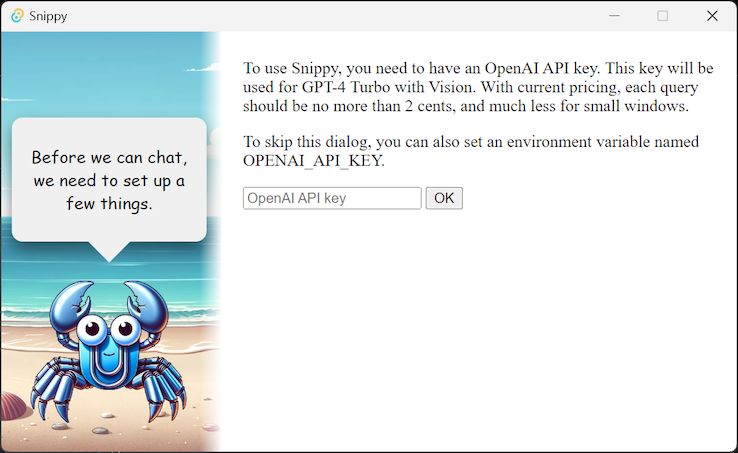
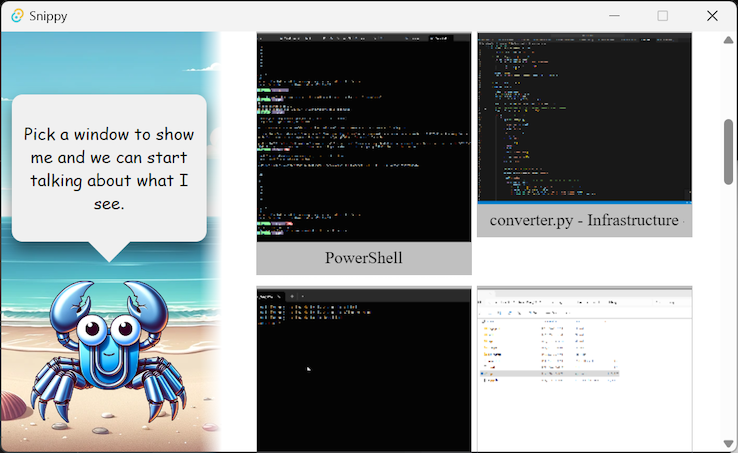
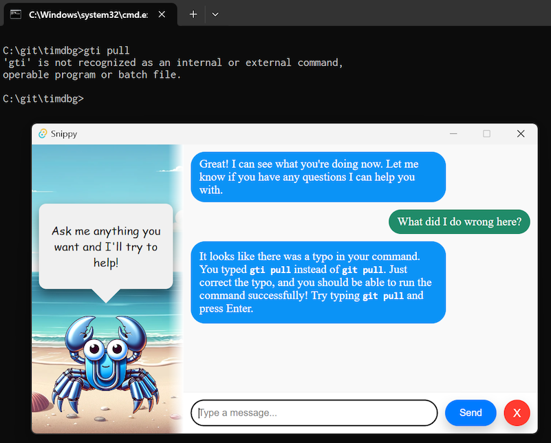
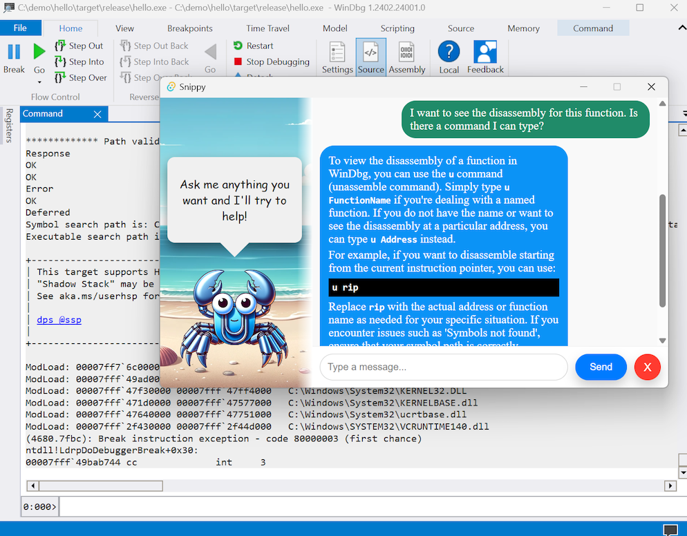

# Snippy

Snippy is an AI assistant that can see a window that you share with it. It uses GPT-4 with vision as additional context for the AI assistant, and is a demo app for [CrabGrab](https://github.com/AugmendTech/CrabGrab), a Rust crate for doing application and screen capture.

To run Snippy, clone the repo and run via `cargo run`

You'll be prompted to enter an OpenAI API key. This is to use GPT-4 and will cost about 2 cents per query.

After that, you'll see a list of windows that Snippy can start looking at.

Once you've picked a window, you can start having a chat with Snippy. Each time you send a message, a screenshot of your window is sent to GPT-4 with your chat message. Using this context, the assistant can give more relevant responses, such as responding to error messages on the screen.

This context can also be useful for resolving ambiguities, such as this question where the answer is relevant to the specific program that is being used.

